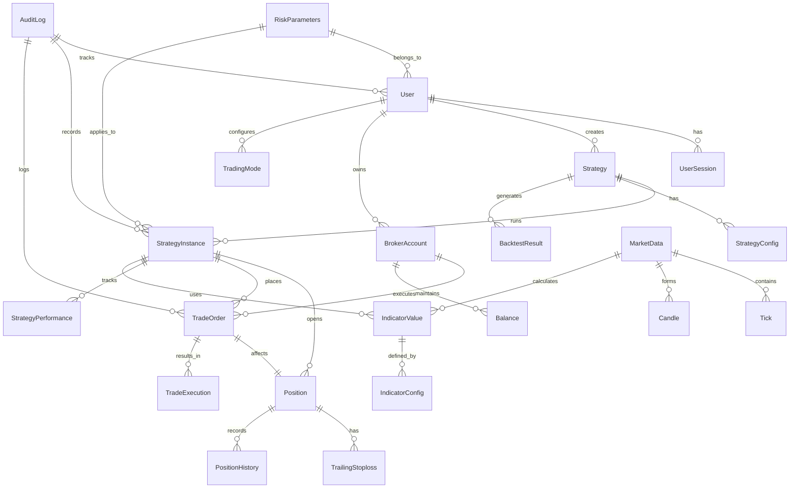

# Data Model: High-Frequency Algo Trading Platform

**Date**: 2025-10-29  
**Purpose**: Entity definitions and relationships for the trading platform

## Entity Relationship Diagram

## Core Entities

### User Management

- `is_active` (Boolean): Account status
- `created_at` (Timestamp): Account creation time
- `updated_at` (Timestamp): Last update time
- `last_login` (Timestamp): Last login time

**Relationships**:
- One-to-Many with Strategy (created strategies)
- One-to-Many with UserSession (active sessions)
- One-to-Many with AuditLog (generated logs)
- One-to-One with RiskParameters (risk settings)

**Validation Rules**:
- Username: 3-50 characters, alphanumeric + underscore
- Email: Valid email format
- Password: Minimum 8 characters, at least one uppercase, lowercase, number, and special character

### Strategy

**Purpose**: Trading strategy definitions with rules and parameters

**Fields**:
- `id` (UUID, Primary Key): Unique identifier
- `user_id` (UUID, Foreign Key): Strategy owner
- `name` (String): Strategy name
- `description` (Text): Strategy description
- `strategy_type` (Enum): MOMENTUM, MEAN_REVERSION, ARBITRAGE, CUSTOM
- `entry_rules` (JSON): Entry condition rules
- `exit_rules` (JSON): Exit condition rules
- `position_sizing` (JSON): Position sizing rules
- `indicator_config` (JSON): Indicator configurations
- `is_active` (Boolean): Strategy status
- `created_at` (Timestamp): Creation time
- `updated_at` (Timestamp): Last update time

**Relationships**:
- Many-to-One with User (owner)
- One-to-Many with StrategyInstance (running instances)
- One-to-Many with BacktestResult (backtest results)
- One-to-Many with StrategyConfig (configurations)

**Validation Rules**:
- Name: 1-100 characters, unique per user
- Entry/Exit rules: Valid JSON with required fields
- Position sizing: Valid JSON with positive values

### StrategyInstance

**Purpose**: Running instances of strategies with specific configurations

**Fields**:
- `id` (UUID, Primary Key): Unique identifier
- `strategy_id` (UUID, Foreign Key): Base strategy
- `user_id` (UUID, Foreign Key): Instance owner
- `instance_name` (String): Instance identifier
- `broker_account_id` (UUID, Foreign Key): Trading account
- `trading_mode` (Enum): LIVE, PAPER
- `symbols` (JSON Array): List of trading symbols
- `capital_allocation` (Decimal): Allocated capital
- `risk_parameters_id` (UUID, Foreign Key): Risk settings
- `is_running` (Boolean): Running status
- `started_at` (Timestamp): Start time
- `stopped_at` (Timestamp): Stop time
- `created_at` (Timestamp): Creation time

**Relationships**:
- Many-to-One with Strategy (base strategy)
- Many-to-One with User (owner)
- Many-to-One with BrokerAccount (trading account)
- Many-to-One with RiskParameters (risk settings)
- One-to-Many with Position (open positions)
- One-to-Many with TradeOrder (placed orders)
- One-to-Many with StrategyPerformance (performance data)

**Validation Rules**:
- Instance name: 1-100 characters, unique per user
- Capital allocation: Positive value
- Symbols: Valid NSE symbols

### Market Data

**Purpose**: Real-time and historical market data storage

**Fields**:
- `symbol` (String, Primary Key): Trading symbol
- `exchange` (String): Exchange name (NSE)
- `sector` (String): Sector classification
- `lot_size` (Integer): Standard lot size
- `tick_size` (Decimal): Minimum price movement
- `is_active` (Boolean): Trading status
- `created_at` (Timestamp): First data timestamp
- `updated_at` (Timestamp): Last update timestamp

**Relationships**:
- One-to-Many with Tick (tick data)
- One-to-Many with Candle (candle data)

**Validation Rules**:
- Symbol: Valid NSE symbol format
- Exchange: Must be "NSE" for current implementation
- Tick size: Positive decimal value

### Tick (Time-Series Data)

**Purpose**: Tick-by-tick market data for real-time processing

**Fields**:
- `id` (BigSerial, Primary Key): Auto-incrementing ID
- `symbol` (String, Foreign Key): Trading symbol
- `timestamp` (Timestamp): Tick timestamp
- `price` (Decimal): Trade price
- `volume` (Integer): Trade volume
- `bid_price` (Decimal): Current bid price
- `ask_price` (Decimal): Current ask price
- `bid_volume` (Integer): Bid volume
- `ask_volume` (Integer): Ask volume
- `open_interest` (Integer): Open interest (for derivatives)

**Relationships**:
- Many-to-One with MarketData (symbol information)

**Validation Rules**:
- Price, bid_price, ask_price: Positive decimal values
- Volume, bid_volume, ask_volume: Non-negative integers
- Timestamp: Must be within market hours

### Candle (Time-Series Data)

**Purpose**: Aggregated candle data for charting and analysis

**Fields**:
- `id` (BigSerial, Primary Key): Auto-incrementing ID
- `symbol` (String, Foreign Key): Trading symbol
- `timestamp` (Timestamp): Candle start time
- `timeframe` (Enum): 1MIN, 5MIN, 15MIN, 30MIN, 1HOUR, 1DAY
- `open_price` (Decimal): Opening price
- `high_price` (Decimal): Highest price
- `low_price` (Decimal): Lowest price
- `close_price` (Decimal): Closing price
- `volume` (Integer): Total volume
- `num_trades` (Integer): Number of trades

**Relationships**:
- Many-to-One with MarketData (symbol information)

**Validation Rules**:
- OHLC prices: Positive decimal values with valid relationships (high >= open,close,low)
- Volume, num_trades: Non-negative integers
- Timestamp: Aligned to timeframe boundaries

### Position

**Purpose**: Current trading positions with P&L tracking

**Fields**:
- `id` (UUID, Primary Key): Unique identifier
- `strategy_instance_id` (UUID, Foreign Key): Strategy instance
- `symbol` (String): Trading symbol
- `quantity` (Integer): Position quantity (positive for long, negative for short)
- `average_price` (Decimal): Average entry price
- `current_price` (Decimal): Current market price
- `unrealized_pnl` (Decimal): Unrealized profit/loss
- `realized_pnl` (Decimal): Realized profit/loss
- `total_pnl` (Decimal): Total profit/loss
- `opened_at` (Timestamp): Position open time
- `updated_at` (Timestamp): Last update time
- `closed_at` (Timestamp): Position close time

**Relationships**:
- Many-to-One with StrategyInstance (owning strategy)
- One-to-Many with TradeOrder (related orders)
